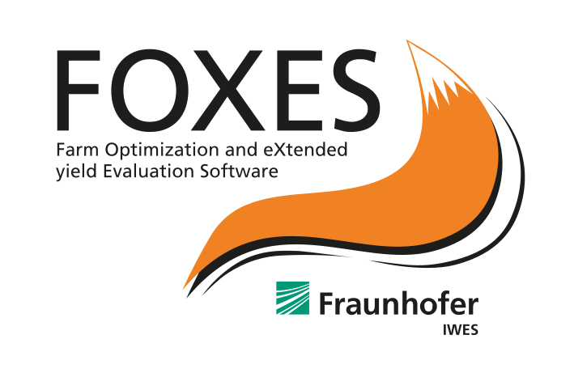

foxes
=====

| `Documentation <https://fraunhoferiwes.github.io/foxes.docs/index.html>`_
| `GitHub <https://github.com/FraunhoferIWES/foxes>`_
| `Examples <https://fraunhoferiwes.github.io/foxes.docs/examples.html>`_
| Cite :cite:`foxes2023`

*FOXES* is an open-source wind farm and wake modelling framework in Python by Fraunhofer IWES.
It is based on the fast vectorized evaluation of engineering wake models
and has been optimized for runs of large scenarios, e.g., long-term timeseries input
data combined with large wind farms with up to thousands of turbines.

Configuration Options
---------------------

foxes shares most configuration options with PyWake via the ``analysis.yaml`` file.
Refer to the :doc:`pywake` documentation for common options.

**foxes-specific features:**

- Optimized for large wind farms (1000+ turbines)
- Efficient chunked processing for long time series
- Multiple computation engines (multiprocessing, threading, dask)
- Native WindIO integration via ``foxes.input.yaml.windio``

Engine Selection
~~~~~~~~~~~~~~~~

foxes supports multiple computation engines:

- ``default``: Single-threaded (good for debugging)
- ``process``: Multi-process parallelization (recommended for CPU-bound)
- ``thread``: Multi-threaded parallelization
- ``dask``: Distributed computing with Dask

API Reference
-------------

Usage
~~~~~

**Command Line:**

.. code-block:: console

   wifa_foxes path/to/system.yaml

   # With options
   wifa_foxes system.yaml -o results -n 4 -v 1

**Python:**

.. code-block:: python

   from wifa.foxes_api import run_foxes

   # Basic usage
   farm_results, point_results, outputs = run_foxes("path/to/system.yaml")

   # With parallel processing
   farm_results, point_results, outputs = run_foxes(
       "system.yaml",
       engine="process",
       n_procs=4,
       chunksize_states=1000
   )

Command Line Options
~~~~~~~~~~~~~~~~~~~~

.. code-block:: text

   wifa_foxes input.yaml [options]

   Options:
     -o, --output_dir        Output directory
     -e, --engine            Computation engine (default, process, thread, dask)
     -n, --n_procs           Number of processes for parallel execution
     -c, --chunksize_states  Chunk size for states dimension
     -C, --chunksize_points  Chunk size for points dimension (default: 5000)
     -it, --iterative        Use iterative algorithm (for blockage)
     -v, --verbosity         Verbosity level (0=silent, 1=normal)

CLI Examples
~~~~~~~~~~~~

.. code-block:: console

   # Parallel run with 8 processes
   wifa_foxes system.yaml -e process -n 8

   # Custom output directory, verbose
   wifa_foxes system.yaml -o my_results -v 1

   # Large time series with chunking
   wifa_foxes system.yaml -e process -n 4 -c 1000

   # Batch processing with all available cores
   wifa_foxes system.yaml -e process -n $(nproc) -c 5000

   # Run all example cases
   for case in examples/cases/*/wind_energy_system/system.yaml; do
       wifa_foxes "$case" -o "results/$(dirname $(dirname $case) | xargs basename)"
   done

.. py:function:: wifa.foxes_api.run_foxes(input_yaml, input_dir=None, output_dir=None, engine="default", n_procs=None, chunksize_states=None, chunksize_points=None, verbosity=1, **kwargs)

   Run a foxes simulation from WindIO input.

   :param input_yaml: Path to WindIO YAML file or pre-loaded dictionary
   :type input_yaml: str or dict
   :param input_dir: Base directory for relative paths in input
   :type input_dir: str, optional
   :param output_dir: Output directory
   :type output_dir: str, optional
   :param engine: Computation engine (default, process, thread, dask)
   :type engine: str
   :param n_procs: Number of processes for parallel execution
   :type n_procs: int, optional
   :param chunksize_states: Chunk size for states dimension
   :type chunksize_states: int, optional
   :param chunksize_points: Chunk size for points dimension
   :type chunksize_points: int, optional
   :param verbosity: Verbosity level (0=silent)
   :type verbosity: int
   :param kwargs: Additional parameters for foxes.input.yaml.run_dict
   :returns: Tuple of (farm_results, point_results, outputs)
   :rtype: tuple

   **Example:**

   .. code-block:: python

      from wifa.foxes_api import run_foxes

      farm_results, point_results, outputs = run_foxes(
          "system.yaml",
          engine="process",
          n_procs=8
      )
      print(farm_results.P)  # Power per turbine

Outputs
~~~~~~~

Returns a tuple of three elements:

1. ``farm_results``: xarray.Dataset with per-turbine results
2. ``point_results``: xarray.Dataset with flow field results (if requested)
3. ``outputs``: List of additional output tuples
